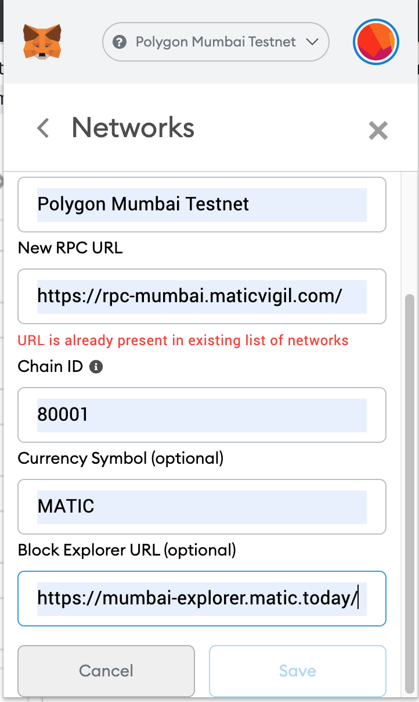

# Ethereum Matic Bridge

### About
Make use of a POS Ethereum-Matic bridge to move tokens between the mapped networks
Goerli testnet on Ethereum and Mumbai testnet on Polygon Matic Network.
To understand how tokens are mapped to each other visit [Mapped Tokens at Matic documentation](https://docs.matic.network/docs/develop/network-details/mapped-tokens)

### Get started

1. Install packages
```sh
$ npm install 
```

2. Connect Metamask to Ethereum Goerli testnet network and Polygon Matic Mumbai testnet
<span>
</span>


3. Get DummyERC20 (DERC20) tokens on Goerli testnet from [https://faucet.matic.network/](https://faucet.matic.network/)


3. Run code
```sh
$ node index.js